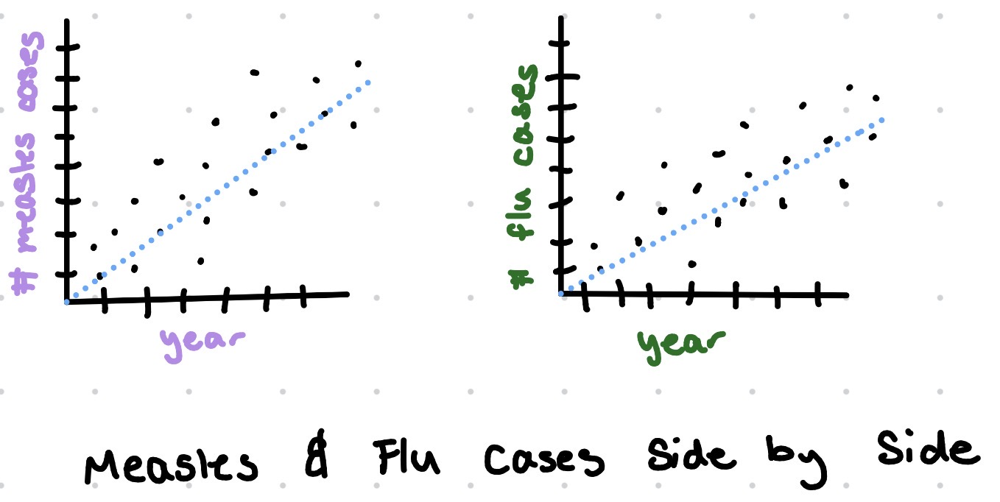
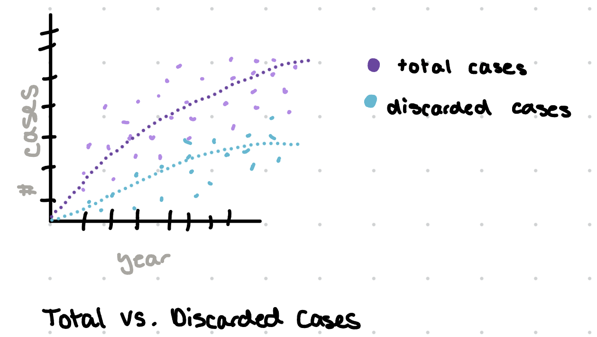

## **Context of the data**

The measles data set is a collection of all possible cases of measles and rubella in the world from the WHO. These data is provisional data based on monthly reported data to the WHO as of June 2025. This data set includes two sections, cases divided by month and cases by year. The cases by month contains the region, country, three letter country code, year, and month of each measles and rubella case. The types of measles and rubella cases are divided into a suspected case, a clinically-compatible case, an epidemiologically-linked case and a laboratory-confirmed case. There are also variables for total cases for both measles and rubella and also discarded cases that were concluded to be non-measles or non-rubella. The cases by year contains the region, country, three letter country code, year, country population, annualized population 2025 and the total suspected measles and rubella cases, the total measles cases, the lab confirmed measles cases, the epidemiologically linked measles cases, the clinical measles cases, and a measles cases per million population. There are all the same variables for rubella cases as well. There are also variables for discarded cases and discarded cases per million population.

## **Cleaning done to the data**

Column names in both datasets were standardized using clean_names() to ensure all variable names look the same. In the cases_month dataset, all variables from year to discarded were changed to numeric data types.

The cases_year dataset was changed to use the first row as column headers and were then later removed. Several variables had their names cahnged to be more readable such as member_state to country and replacing placeholder names like na and na_2 to measles_lab_confirmed and measles_epi_linked.

## **Research questions that can be addressed with these data**

-   How many suspected measles cases ended up being lab confirmed?

-   Are certain countries consistently having the highest or lowest number of measles cases?

## **Research questions that can be addressed with supplemental data**

-   Is there a rise in measles cases at the same time as other diseases?

-   Is there actually a change in number of measles cases or is it due to improved healthcare?

## **Visualizations**

